<div align="center">  <a href="https://github.com/j0yb0y-m">  </a>

<br><br>
    

</div>

<br>

```bash
mahdi@j0yb0y:~$ whoami
Mahdi "J0yB0y" — Cybersecurity Engineering Student, 2nd year

mahdi@j0yb0y:~$ cat focus.txt
Penetration Testing / Offensive Security

mahdi@j0yb0y:~$ neofetch --minimal
Location   Iraq
Shell      fish
Theme      Catppuccin Mocha
Status     [ONLINE] probably breaking something on purpose

mahdi@j0yb0y:~$ _
```

<br> <div align="center">

### Arsenal

      

<br><br>

    </div> <br> <div align="center">

### Stats

  <br>  </div> <br> <div align="center">

### Trophies


</div> <br> <div align="center">

### Contribution Graph

<!--START_SECTION:activity--> <!-- this section auto-fills once you wire up the activity-graph action, see notes below --> <!--END_SECTION:activity-->  </div> <br> <div align="center"> <!-- Snake contribution animation - requires the GitHub Action below -->  </div> <br> <div align="center">

### Connect

<a href="https://github.com/j0yb0y-m"></a> <a href="mailto:jb.mahdi@outlook.com"></a>

<br><br>

### Profiles

<a href="https://tryhackme.com/p/the.j0yb0y"></a>
<a href="https://app.hackthebox.com/profile/019cf947-341f-7358-8e3e-2758c5a13f3e"></a>

<br><br>

 </div>
